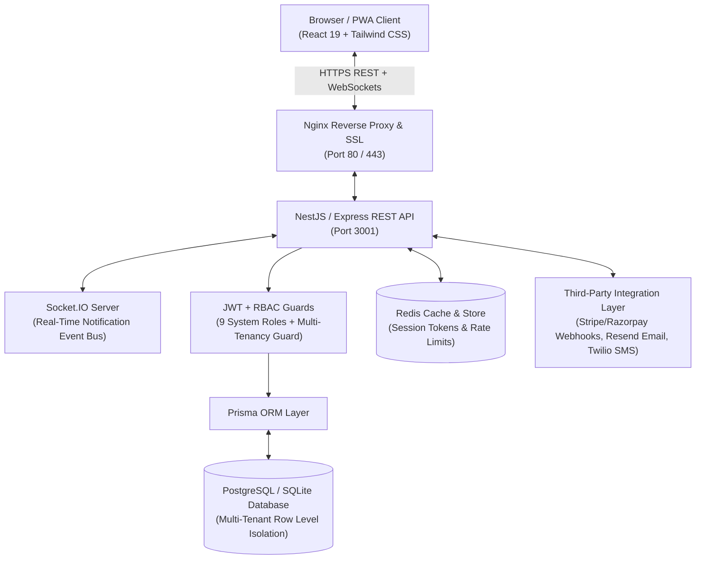

# MedCore HMS System Architecture Diagram

## Architectural Highlights
1. **Multi-Tenancy Strategy**: Row-Level Multi-Tenancy where every database table containing tenant-scoped data carries a mandatory `hospitalId` foreign key. An automated `enforceTenancy` middleware validates all incoming request parameters against the caller's JWT scope.
2. **Role-Based Access Control (RBAC)**: Fine-grained permissions matrix across 9 distinct roles (`SUPER_ADMIN`, `HOSPITAL_ADMIN`, `DOCTOR`, `NURSE`, `RECEPTIONIST`, `LAB_TECHNICIAN`, `PHARMACIST`, `ACCOUNTANT`, `PATIENT`).
3. **Concurrency-Safe Scheduling Engine**: Database transaction locking on slot allocation to guarantee that no doctor or patient is double-booked simultaneously.
4. **FIFO Pharmacy Inventory**: Automated First-In First-Out batch allocation that quarantines and blocks expired medicine stock from being dispensed.
5. **Real-Time Notification Gateway**: Socket.IO bi-directional WebSocket event bus delivering instant in-app alerts for lab result approvals, emergency bookings, and payment status receipts.
