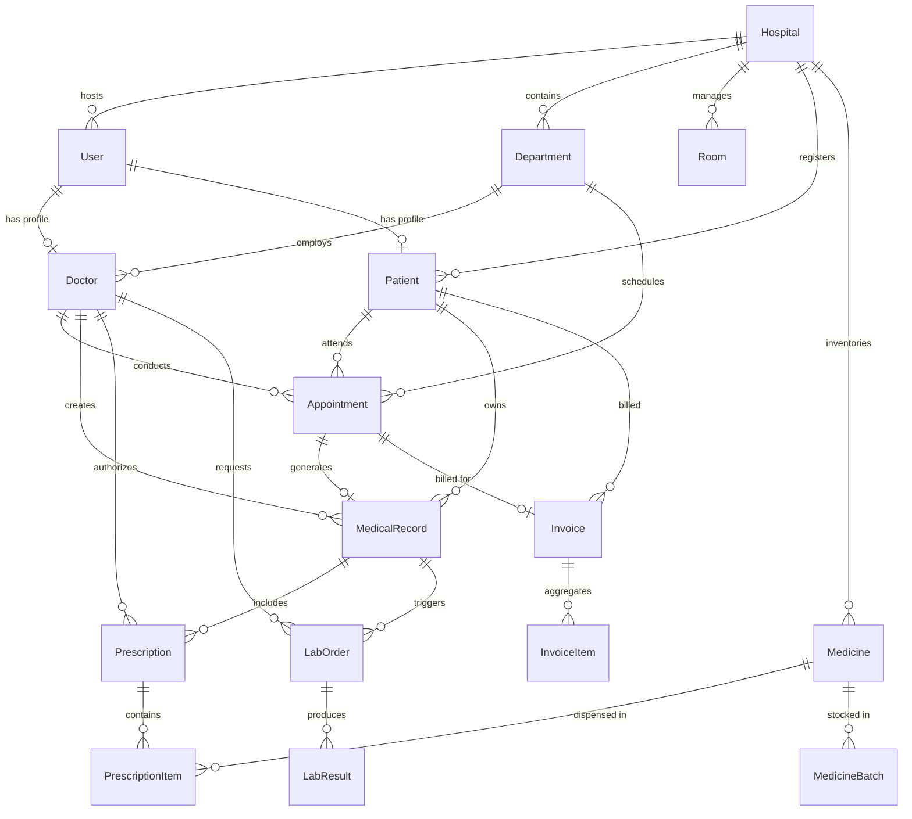

# MedCore HMS Entity Relationship (ER) Diagram

## Core Models Normalization
- **3NF Normalization**: Clean separation between generic `User` authentication records and role-specific `Doctor` / `Patient` extension models.
- **Audit Logs & Soft Deletes**: Medical records are append-only. Patients and doctors feature soft delete capability (`deletedAt`).
